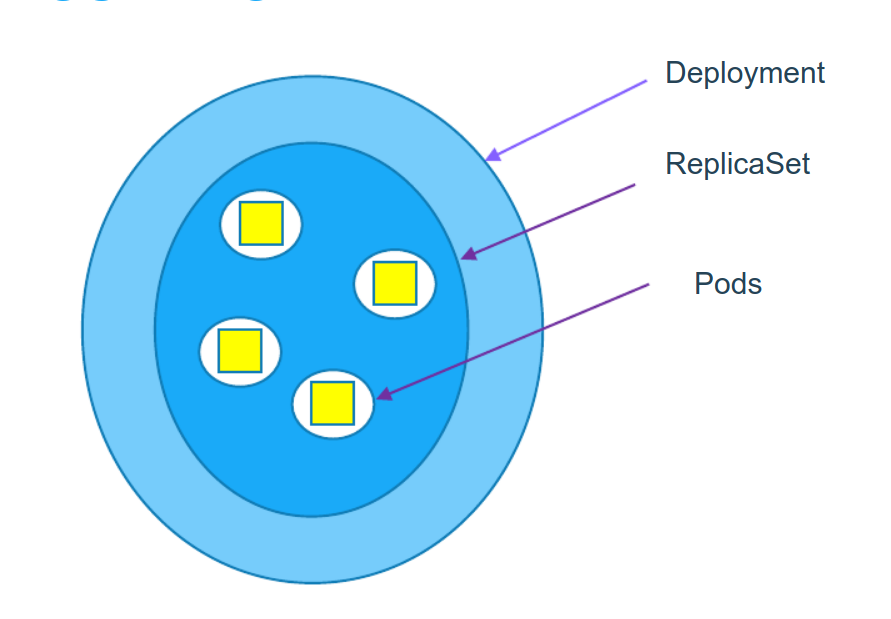

# Deployment

## 1. Deployment
-  Là 1 resource trong k8s, dùng trong quá trình CD, cập nhật 1 phiên bản mới của ứng dụng mà không gây ảnh hưởng nhiều đến client.


- 2 chiến lược phổ biến nhất trong k8s là Recreate và RollingUpdate
- Các version update sẽ có history, từ đó có thể rollback hoặc rollout giữa các version.

### Recreate:
- Sẽ xóa toàn bộ version cũ của ứng dụng và deploy version mới lên. Đối với k8s, đầu tiền cập nhật Pod template của ReplicaSet sau đó ta xóa toàn bộ Pod hiện tại để RS tạo ra Pod với template mới. Với cách này, dễ dàng và đơn giản nhưng ứng dụng sẽ bị downtime.

### RollingUpdate:
- Deploy từng version của ứng dụng lên, chắc chắn nó chạy, dẫn request tới version mới này và lặp lại quá trình cho đến khi toàn bộ version được update. Đối với k8s, xóa từng Pod và RS sẽ tạo lại Pod mới. Với cách này, sẽ có thời điểm cả 2 version của ứng dụng cùng chạy.

### Blue-Green update:
- Duy trì 2 môi trường BLue (version hiện tại) và Green (version mới). Blue đang hoạt động trong khi Green sẵn sàng thay thế, đến khi Green sẵn sàng thì chuyển toàn bộ traffic  từ Blue sang Green.
- Cung cấp phương pháp nhanh chóng khôi phục khi version mới có vấn đề, chỉ cần định tuyến lại Blue.

example.yaml
```
apiVersion: apps/v1
kind: Deployment 
metadata:
  name: hello-app
spec:
  replicas: 3
  strategy: # change here
    type: RollingUpdate # strategy type is Recreate or RollingUpdate. Default is RollingUpdate
  selector:
    matchLabels:
      app: hello-app
  template:
    metadata:
      labels:
        app: hello-app
    spec:
      containers:
      - image: 080196/hello-app:v1
        name: hello-app
        ports:
          - containerPort: 3000
```


## 2. Cheat sheet:
- update pod template ( change image )
```
kubectl set image deployment <deployment-name> <container-name>=<new-image>
```
- rollout (update) version:
```
kubectl rollout status deploy <deployment-name>
```
- rollback version:
```
kubectl rollout undo deployment <deployment-name> --to-revision=<version>
```

