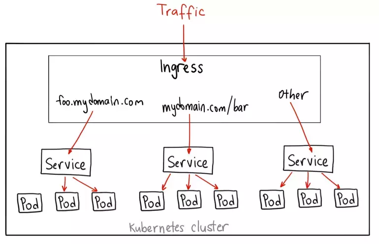

# Ingress - Egress trong Kubernetes

## Ingress và Egress
- Ingress và Egress là 2 loại tài nguyên, đại diện cho lưu lượng đi vào cụm và egress đại diện cho lưu lượng đi ra khỏi cụm.


## 1. Ingress:

- là một loại tài nguyên gốc (~pod, deployment, ...), sử dụng để duy trì cấu hình định tuyến DNS.
- Với service, chỉ có type NodePort là có thể expose 1 ứng dụng ra bên ngoài (chỉ tính onprem), mà phải expose qua port và số lượng port bị hạn chế trong 30000-32767:
    + NodePort: đơn giản, k8s sẽ cấp 1 port xác định trên mỗi node thuộc cluster cho service
    + LoadBalancer (cloud): 
- Ingress ra đời giải quyết vấn đề này:
    + Có thể expose ứng dụng dưới dạng ClusterIP và dùng Ingress expose ra bên ngoài, ứng dụng sẽ trong suốt với người dùng, người dùng chỉ đang kết nối tới Ingress Controller.
    + ...

- Cung cấp các quy tắc để định tuyến lưu lượng http/https đến các service dựa trên các thuộc tính domain, ...
- Việc thực thi phân luồng này được thực hiện bởi Ingress Controller, là một opensource được cài trên k8s.
- Ingress gồm 2 thành phần chính:
    + Ingress Controller: nhiệm vụ điều khiển điều hướng các request tới các service bên trong.
    + Ingress Rule: là một loại tài nguyên trên k8s, chứa nội dung khai báo rule để điều hướng từ một request tới 1 service cụ thể.
- Có nhiều loại Ingress Controller, phổ biến: Nginx Ingress Controller, Traefik, HAProxy, Contour, ...

- Dùng Ingress để expose sẽ đơn giản hơn sử dụng load balancer hoặc expose service từng node.

### ingress resource:
example.yaml:
```
apiVersion: networking.k8s.io/v1
kind: Ingress
metadata:
  name: minimal-ingress
  annotations:
    nginx.ingress.kubernetes.io/rewrite-target: /
spec:
  ingressClassName: nginx-example
  rules:
  - http:
      paths:
      - path: /testpath
        pathType: Prefix
        backend:
          service:
            name: test
            port:
              number: 80
```

### ingress rules:
- bao gồm các thông tin:
    + host: (không bắt buộc) nếu có, rule sẽ chỉ apply cho host đó
    + ds path: mỗi path sẽ có thông tin pathType và một backend tương ứng với port
    + backend, gồm một service và port, request mà thỏa mãn điều kiện sẽ chuyển tiếp đến đây.

- PathType: 

### Hướng dẫn expose ứng dụng ra ngoài bằng ingress và clusterIP:
- Tạo pod và expose ra service dưới dạng clusterIp

apple.yaml:
```
kind: Pod
apiVersion: v1
metadata:
  name: apple-app
  labels:
    app: apple
spec:
  containers:
    - name: apple-app
      image: hashicorp/http-echo
      args:
        - "-text=THIS_IS_APPLE"
---

kind: Service
apiVersion: v1
metadata:
  name: apple-service
spec:
  selector:
    app: apple
  ports:
    - port: 5678 # Default port for image
```
- Tạo ingress để expose ứng dụng

ingress.yaml
```
apiVersion: networking.k8s.io/v1
kind: Ingress
metadata:
  annotations:
  name: apple.prod.viettq.com
spec:
  #ingressClassName: nginx
  rules:
  - host: apple.prod.viettq.com # quy tắc này áp dụng cho các request đến từ domain này
    http:
      paths: 
      - backend:
          service:
            name: apple-service
            port:
              number: 5678
        path: / # path: / có nghĩa là tất cả endpoint
        pathType: Prefix

```

- Từ đây có thể truy cập pod thông qua ```< IP pod >:5678``` hoặc ```< IP clusterIP >:5678``` hoặc ```apple.prod.viettq.com```

### Hướng dẫn expose Nginx ra ngoài bằng ingress và clusterIP:
- tạo pod:
```
apiVersion: v1
kind: Pod
metadata:
  name: nginx-pod
  labels:
    app: nginx
spec:
  containers:
  - name: nginx
    image: nginx:latest
    ports:
    - containerPort: 80
```
- tạo service expose pod ra ngoài:
```
apiVersion: v1
kind: Service
metadata:
  name: nginx-service
spec:
  selector:
    app: nginx
  ports:
  - protocol: TCP
    port: 80
    targetPort: 80
  type: ClusterIP
```
- tạo ingress expose service ra ngoài:
```
apiVersion: networking.k8s.io/v1
kind: Ingress
metadata:
  name: nginx-ingress
spec:
  rules:
  - hosts: nginx.example.com
    http:
      paths:
      - path: /
        pathType: Prefix
        backend:
          service:
            name: nginx-service
            port:
              number: 80
```

## 2. Egress
